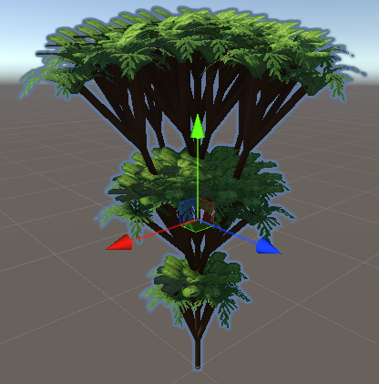
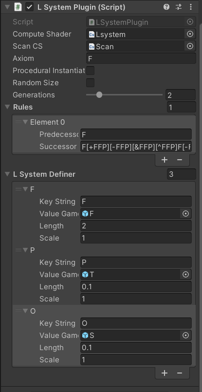
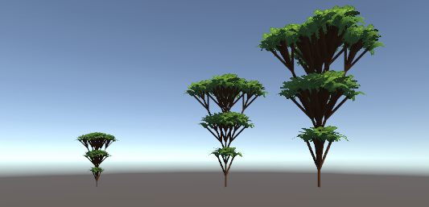
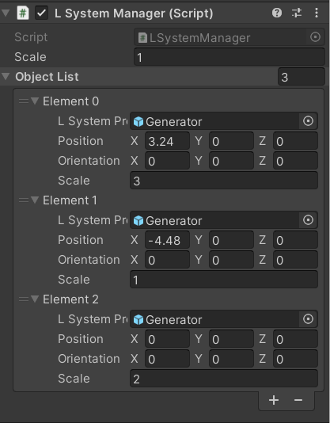
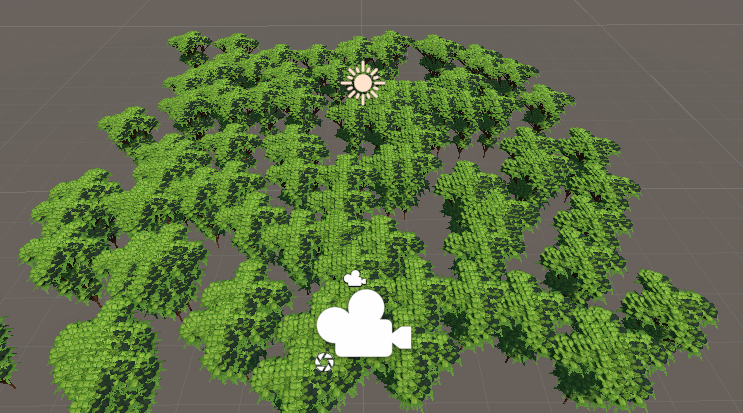
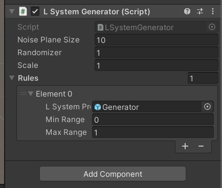

# Unity-GPU-LSystem-Generator
Generator of L-System using GPU  

## Overview
In my final project for [CIS565 GPU Programming](https://cis565-fall-2022.github.io/), our team did an [AR procedural generation project](https://github.com/Scriptwonder/ARC-Procedural-Generation-GPU) that could generate plants using GPU. My work in this project is to implement the L-System Derivation/Interpretation using Unity's Compute Shader and then bring them to the game view.  
When I am searching during the project I did not find any L-System implementation that utilize the GPU and compute shader that much, and their runtime is usually slow at large iterations. So I think it would be cool to do a plugin for these who want beautiful and complex L-Systems to their game.  
The plugin consists of three functions able to use, the generator which instantiate one specific L-System, manager that can handle a large number of L-System Prefabs, and a simple noise function that could generate a large pile of L-System.
Details of how to implement the L-System in Unity and Compute Shader is in [AR procedural generation project](https://github.com/Scriptwonder/ARC-Procedural-Generation-GPU)'s Readme, this repo is for instruction!

## Generator

- Rules and axiom will be used for context derivation;
- Generations are limited to 6, because current scan method can handle 212644 elements, which is similar to a derived complex string length at iteration 6;
- LSystemDefiner marks which gameobject corresponds to the supposed character( NOTES: the gameobject's name does not have to be F!)
- The length needs to be put as the length of that gameobject in world coordinates, so the GPU will calculate each symbol's position correctly; scale is for moderation in case the user want to have different scales;

## Manager
  
  
After you create an L-System you like, store it as a prefab and it can be used in Manager.   
Manager is a simple object list where you can assign each L-System's Pos/Ori/Scale  

## Noise

- Noise Plane Size indicates how many tile that the generator will generate L-System Prefabs
- set min range and max range for each prefab(between 0 and 1), and they will have a probability of instantiation of (MaxRange-MinRange)/1

## Future TODO
In the current version, I use Unity Instantiate to instantiate these symbols as gameobjects, which is theoretically slower than using DrawMesh or DrawProcedural method. Back when implementing DrawMesh there are a few problems and bugs which stop me from trying this. Giving more time I might try to implement DrawMesh to make it look as the same as using Instantiate, with more efficiency because the use of GPU.